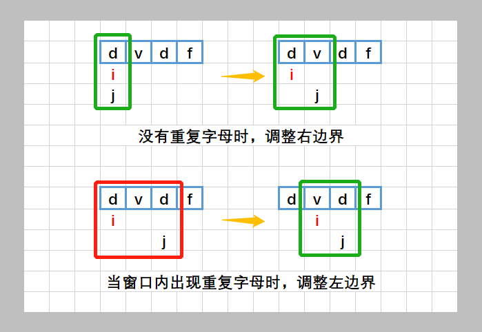
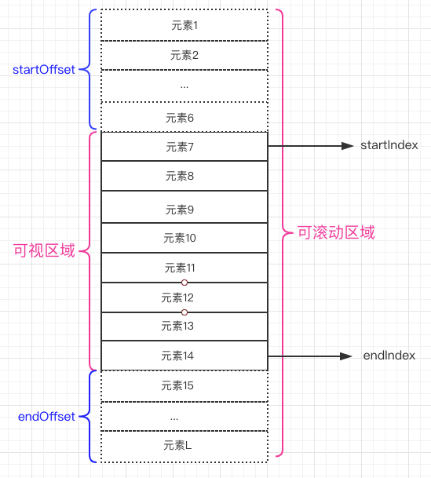
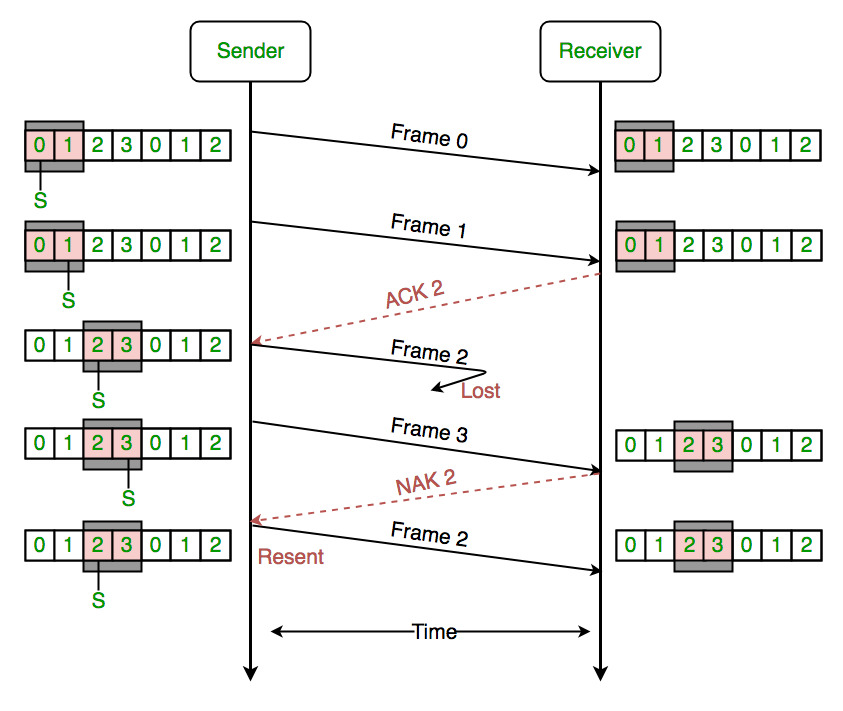

### 滑动窗口 Sliding window

#### 什么是滑动窗口算法？
滑动窗口问题是动态编程问题的子集，是改变窗口大小和位置从而获取最优解的一种方式


#### 原理是什么？

利用双指针动态改变窗口的大小和位置，截取连续值

#### 解决什么问题？

- 常应用于一个有序且可迭代的数据结构，如数组或字符串
- 在数组，字符串中寻找某个子范围，例如最长，最短
- 化解O(N²)或更大复杂度为O(N) 复杂度（嵌套for循环转换为单个for循环以减少时间复杂度）

#### 应用场景

##### 1.滑动窗口算法
示例： [3.无重复字符的最长子串](https://leetcode-cn.com/problems/longest-substring-without-repeating-characters)



示例代码：
```js
var lengthOfLongestSubstring = function (s: string) {
  if (s.length === 0) return 0;
  const length = s.length;
  let subStr = s[0];
  let subMaxLength = 1;
  let i = 0;
  let j = 1;
  while (j < length) {
    if (subStr.includes(s[j])) {
      // 假如现有的子字符串包含下一个字符则重新从当前字符开始
      const index = subStr.indexOf(s[j]) + 1; // 需要截取的位置
      subStr = subStr.slice(index);
      i = i + index;
    } else {
      // 假如不包含则加进来
      subMaxLength = Math.max(subMaxLength, j + 1 - i);
    }
    subStr += s[j];
    j++;
  }

  return subMaxLength;
};

```


##### 2.虚拟列表
虚拟列表是按需显示思路的一种实现，即虚拟列表是一种根据滚动容器元素的可视区域来渲染长列表数据中某一个部分数据的技术。虚拟列表指的就是「可视区域渲染」的列表。有三个概念需要了解一下：

- 滚动容器元素：某个元素能在内部产生横向或者纵向的滚动，那这个元素就是滚动容器元素
- 可滚动区域：滚动容器元素的内部内容区域。假设有 100 条数据，每个列表项的高度是 50，那么可滚动的区域的高度就是 100 * 50。可滚动区域当前的具体高度值一般可以通过(滚动容器)元素的 scrollHeight 属性获取。用户可以通过滚动来改变列表在可视区域的显示部分。
- 可视区域：滚动容器元素的视觉可视区域。如果容器元素是 window 对象，可视区域就是浏览器的视口大小(即视觉视口)；如果容器元素是某个 div 元素，其高度是 300，右侧有纵向滚动条可以滚动，那么视觉可见的区域就是可视区域

实现虚拟列表就是在处理用户滚动时，要改变列表在可视区域的渲染部分，其具体步骤如下：

- 计算当前可视区域起始数据的 startIndex
- 计算当前可视区域结束数据的 endIndex
- 计算当前可视区域的数据，并渲染到页面中
- 计算 startIndex 对应的数据在整个列表中的偏移位置 startOffset，并设置到列表上
- 计算 endIndex 对应的数据相对于可滚动区域最底部的偏移位置 endOffset，并设置到列表上



##### 3.滑动窗口协议

滑动窗口协议（Sliding Window Protocol），属于TCP协议的一种应用，用于网络数据传输时的流量控制，以避免拥塞的发生。该协议允许发送方在停止并等待确认前发送多个数据分组。由于发送方不必每发一个分组就停下来等待确认。因此该协议可以加速数据的传输，提高网络吞吐量。

